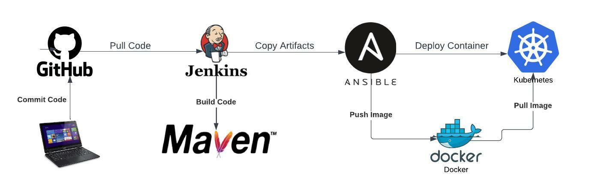

# Jenkins CI/CD pipeline for a simple java application

Simple CI/CD pipeline to deploy the app on AWS K8s cluster.

A brief description of what this project does:

## Infra Setup:
    1. Created Jenkins server on AWS EC2 instance.
    2. Setup Maven server on the same Jenkins server for simplicity.
    3. Setup Ansible server on EC2 instance.
    4. Setup bootstrap server for EKS.

## Deployment steps:
    1. Jenkins job to make use of  ansible playbook to provision EKS cluster.
    2. Setup CI jenkins job to clone, test and build the code and then push the image to docker hub.
    3. Setup the final jenkins job to continously deploy the code to the EKS cluster if the CI job is successful.

## So the final flow should be like this:

